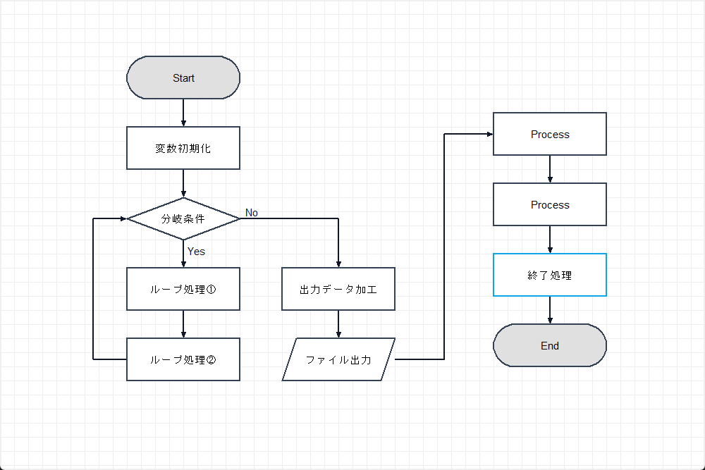
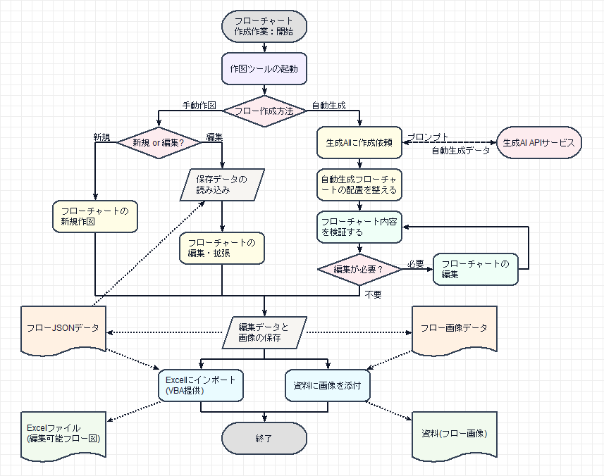

# flowchart-drawing-tool-python Simple Flowchart Drawing Tool (Python Version)

## Overview

This project provides a “Simple Flowchart Drawing Tool (Python Version)” that allows you to easily draw flowcharts.

## Project Purpose

- Have you ever felt the following frustrations or stress when creating flowcharts?
  - During requirement definition to detailed design, you want to use simple flowcharts to examine business flows or processing logic,
    but you cannot easily find a tool that is simple to draw with and practical for business use, leading to frustration every time you need to draw a flowchart.
  - You create flowcharts in Excel or PowerPoint, but it takes time to adjust them into a satisfactory form, and you get tired of repeatedly re‑adjusting them during edits.
  - In the era of generative AI, are you concerned about specification documents filled only with text? Even if you ask generative AI to create flowcharts, the results are not very good and editing them is difficult.

- Therefore, aiming to create a “casually usable flowchart drawing tool,” this tool was developed in Python.
- The basic functions that were envisioned for drawing simple flowcharts have mostly been implemented, so a provisional version is now released.
- Note: Although the base code was created with ChatGPT, it has been modified afterwards, so some parts of the code are not yet well organized. These will be gradually cleaned up (sorry!).

## Installation

- Prerequisites
  - An environment where Python code can be executed and where the Tkinter library’s Canvas is available.
    (It does not work in web environments such as Google Colaboratory. On macOS, Tkinter must be properly enabled.)

- Installation Steps
  1. Check out the project code in an environment where Python can be executed.
  2. In the checkout folder, run `pip install -r requirements.txt` to install the required packages.
  3. Run `flowchart_tool.py` to display the flowchart drawing tool window.

## Usage

- Placement: Select Process, Decision, Terminator, or I/O from the menu and click inside the canvas to place an element.
  - [Drawable Elements]
    - Terminator: Start, End, Subroutine
    - Process: Processing
    - Decision: Branching
    - I/O: Input/Output
- Connection: Select Link from the menu, then click the source element and destination element in order to draw a connection line between elements.
- Text: Double‑click an element or link on the canvas to enter text edit mode.
- Move: Select Select from the menu and drag and drop an element on the canvas to move it.
- Element Selection: Select Select from the menu and click an element to select it.
- Multiple Selection: Select Select from the menu and drag a rectangular area from an empty space to select multiple elements within the rectangle.
- Delete: Select the Delete button from the menu to delete the selected element(s) and their associated links.
- UNDO/REDO: Select the UNDO or REDO buttons from the menu to undo or redo the most recent edit operation.
- Import/Export: Export the canvas content to image files (JPEG/PNG) or JSON format, or import a saved JSON file to redraw it.
- Grid: Turn on the Grid checkbox in the menu to display a grid and restrict element placement to the grid.
- Manual Link Adjustment: When a link is selected, use CTRL + Mouse Wheel to cycle through connection points, and SHIFT + Mouse Wheel to adjust the routing distance.

* Sample JSON files are placed in the example folder. These files can be loaded using [Load JSON].

## Operation

- In the current provisional version, the following usage is assumed:
  1. Launch the flowchart drawing tool
  2. Draw a new flowchart for new creation
  3. For editing, load saved data first and then edit
  4. Save the completed flowchart data and image
  5. Paste the image into documents

## Limitations

- Link routing is automatically determined based on the positional relationship between elements. Manual placement adjustment is not yet supported (planned for future support).
- Canvas zoom in/out is not supported yet (planned for future support).

## Planned Features

- Optimization of menu structure
- Automatic flowchart generation by reading Mermaid notation text
- Export of drawn flowcharts to Excel
- Addition of other elements and swimlane drawing
- Integration with generative AI (output flows from generative AI and create flowcharts)
- And more

## License

- This project is licensed under the MIT License.

## Update History

* 2025/12/12 : Basic functions (provisional version) released
* 2025/12/15 : Minor adjustments to link routing logic, image export support (JPEG/PNG)
* 2025/12/15b: README update, addition of requirements.txt
* 2025/12/16 : Fix for node position shifting when double‑clicked
* 2025/12/16b: Popup menu support, confirmation dialog displayed on tool exit
* 2025/12/16c: README updated and images added
* 2025/12/17 : Fixed an issue where some elements were not moved when moving multiple elements
* 2025/12/19 : Added adjustable elements to definition files, added separate Japanese/English configuration example files, partially cleaned up source code
* 2025/12/24 : Added manual link adjustment support (CTRL+MouseWheel: change connection points, SHIFT+MouseWheel: adjust routing distance)
* 2025/12/25 : Improve usability and create example videos demonstrating tool usage
