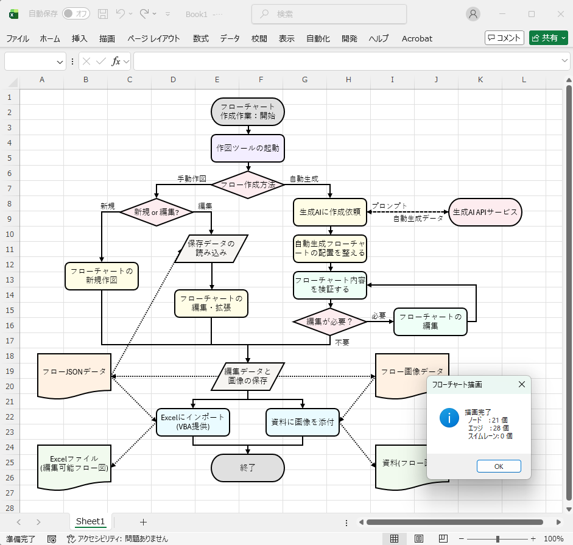

# flowchart-drawing-tool-python 簡易フローチャート描画ツール（Python版)

## 概要

このプロジェクトでは、簡単にフローチャートを描画できるようにする「簡易フローチャート描画ツール(Python版)」を提供します。

## プロジェクトの目的

- フローチャートを書くときに以下のような悩みやストレスはありませんか？
  - 設計段階において、業務フローや処理ロジックを検討する際に、簡易的にフローチャートを描いて整理したいけど、適当な作図ツールが見あたらず、フロー作図作業がとても面倒に感じている。
  - 設計書に残すために、フローチャートをExcelやPowerPointで作図しているけど、満足した形に整えるのに時間がかかり、さらには、ロジック修正や仕様追加による再編集が手間で、うんざりしている。
  - 生成AIを活用する時代になって、文章だらけの仕様書になってしまってとても分かりにくい。生成AIにフローチャートを描かせてもイマイチな図になり、微修正もできなくてモヤモヤしている。

- そんな共通の悩みを持つ方々に向けて、「 “気軽に使える” フローチャート作図ツール」を作成してみました。
- フローチャートを「さっと」描くための基本的な機能がある程度揃ったので、オープンソースとして公開いたします。
- ひとりでも多くの人の役に立てば幸いです。

<div style="text-align: center;">

</div>

## 本ツールの特徴
- 簡易フローチャートを短時間で作図、保存、再編集に対応
- 要素間のリンク接続および要素移動時にリンクを自動配線、手動操作での配線調整も可能
- 生成AI(OpenAI GPT, Google Gemini, Anthropic Claude)と連携して、フローチャートの自動作成に対応（自動作成後にツール上でフローの手動編集が可能）
- 縦・横のスイムレーンの作図に対応
- **新機能(20206.4.7)** 本ツールで作図したフローチャートデータを読み込んで、Excel上で編集可能なフローチャートを作図するVBAを公開 → Excelでの作図作業を大幅に軽減

<div style="text-align: center;">

</div>

<div style="text-align: center;">

</div>

## インストール

- 前提条件
  - 対応OS：Windows11, macOS26.4にて動作確認
  - Pythonコードが実行可能な環境で、さらに、TKinterライブラリのCanvasが利用可能な環境が必要です。
(Google ColaboratoryなどのWeb環境では動作不可、MacOSではTKInterが利用できる設定が必要です)
  - Githubから最新コードをチェックアウトするには、gitコマンドの利用を推奨します。

- インストール手順
  1. コマンドプロンプト（またはターミナル）を起動し、チェックアウト用フォルダを用意します。
  2. チェックアウト用フォルダに移動し、当該プロジェクトのコードをGithubからチェックアウトします。<br><br>
      ```
        git clone https://github.com/YoshiToshi1025/flowchart-drawing-tool-python.git
      ```
  3. チェックアウトフォルダにて、以下のコマンドを実行し、必要なパッケージをインストールします。<br><br>
      ```
        pip install -r requirements.txt
      ```
  4. 英語で使いたい場合は、 constants_en.py を constants.py に上書きコピーします。 
  5. AIによるフロー自動生成を行いたい場合は、チェックアウトフォルダ内の .env ファイルに連携したい生成AIのAPI KEYを記述し、設定ファイル(constants.py)内で生成AIモデル名を指定します。<br>
    ※なお、API Key を設定しなくても、フローチャートの手作業での作図操作は問題なく利用できます。<br><br>
       ```
        [.envファイル内]<br>
        OPENAI_API_KEY=(OpenAI GPT接続用API Key)
        GEMINI_API_KEY=(Google Gemini接続用API Key)
        ANTHROPIC_API_KEY=(Anthropic Claude接続用API Key)
      ```
      ```
        [constants.pyファイル内]
        AI_MODEL=使用する生成AIモデル名
        例) AI_MODEL="gpt-5.4"
      ```
  6. flowchart_tool.pyを実行すると、フローチャート作図ツール画面が表示されます。

## 使い方

- 配置：メニュー欄で Swimlane, Process,Decision,Terminator,I/O,Storage,Document を選択し、キャンバス内で位置を指定することで要素を配置できます。
  -  [描画可能な要素]
     - Swimlane:スイムレーン
     - Terminator：始端、終端、サブルーチン
     - Process：処理
     - Decision：分岐
     - I/O：入出力
     - Storage：ストレージ
     - Dpcument：書類
- 接続：メニュー欄の Link を選択し、接続元要素と接続先要素を順に選択することで、要素間の接続線を描画できます。
- テキスト：キャンバス内の要素またはリンクをダブルクリックすることで、テキスト編集モードになります。
- 移動：メニュー欄の Select を選択し、キャンバス内の要素をドラッグアンドドロップすることで、要素を移動できます。
- 要素選択：メニュー欄の Select を選択し、要素をクリックすることで、当該要素を選択状態にできます。
- 複数選択：メニュー欄の Select を選択し、要素のない位置からドラッグ操作で矩形範囲を指定することで、矩形範囲内の複数要素を選択状態にできます。
- 削除：メニュー欄の Delete ボタンを選択すると、選択状態の（複数）要素と、その要素のリンクが削除されます。
- UNDO/REDO：メニュー欄の UNDO, REDO ボタンを選択すると、直前の編集操作の取り消し,やり直しが可能です。
- インポート/エクスポート：キャンバス描画内容を画像(JPEG/PNG)またはJSON形式でファイルに出力したり、保存JSONファイルをインポートして再描画できます。
- Grid：メニュー欄のGridチェックボックスをONにすると、格子が表示され、要素の配置をグリッドで制限されるようになります。
- フローの自動生成：メニュー欄のAI-generationチェックボックスをONにして、表示される右サイドパネルにて自動生成したい処理フローを指定し、Generateボタンを押下することで、処理フローを自動生成できます。（フローの配置は手動で整えてください）
- リンク配線の手動調整：リンクを選択した状態で、CTRL+MouseWheelで接続点を巡回変更、SHIFT+MouseWheelで回り込みの距離を調整、CTRL+SHIFT+MouseWheelでリンクラベル位置を調整できます。

* exampleフォルダに、サンプルJSONファイルを配置しています。このファイルは[Load JSON]で読み込み可能です。

## 運用

- 現状の暫定版では、以下の利用を想定しています。
  1. フローチャート作図ツールを起動
  2. 手動作成の場合、
      1. 新規作成の場合は、フローチャートを作図
      2. 編集の場合は、保存データを読み込んでから編集
  3. 自動生成の場合、
      1. 自動作成したい処理フローを指定し、生成AIに自動作成を依頼
      2. 自動生成されたフローチャートの各要素や配線を手動調整
      3. フローチャートを確認し、必要に応じてフローを編集
  4. 完成したフローチャートのJSONデータと画像を保存
  5. JSONデータのExcelインポート、または、資料に画像を張り付け

- 想定する作図作業フロー
<div style="text-align: center;">

</div>

- ツール作図データをもとにExcelVBAで自動作図した結果（※リンクの接続先や回り込みの手動調整は必要）
<div style="text-align: center;">

</div>

## 制限事項

- Windowsにおいて、複数ディスプレイで拡大率が異なる場合に「Save Image」の画像保存が正しく動作しません。その場合は、画面キャプチャツールなどを利用ください。
- フローチャートJSONファイルのExcel読込VBAはWindows専用です。(macOS版は対応検討中です)

## 注意事項

- フローチャートの自動作成には指定した生成AIのAPIを利用するため、自動生成を行うごとに 生成AIのAPI利用料 が発生します。

## 対応予定内容

- フローチャートJSONファイルのExcel読込VBA(macOS版) 
- など

## ライセンス

- このプロジェクトは、MIT Licence の下でライセンスされています。

## 更新履歴

* 2025/12/12 : 基本機能を公開
* 2025/12/15 : リンク配線ロジックの調整、画像出力対応(JPEG/PNG)
* 2025/12/16: 不具合対応、ポップアップメニューに対応
* 2026/01/02 : 生成AI(GPT5.2)と連携
* 2026/01/08 : Windowsのディスプレイ拡大率100%以外での画像保存に対応、ショートカットキーの定義
* 2026/02/09 : ノード塗りつぶし色の手動変更に対応
* 2026/03/03 : スイムレーン表示に対応、ノードのハイライト/非ハイライト表示に対応
* 2026/03/17 : キャンバスのリサイズとスクロールに対応
* 2026/03/23 : 直線リンクと線種指定に対応
* 2026/03/24 : ストレージおよび書類の作図に対応
* 2026/03/28 : 複数の生成AIに対応(GPT, Gemini, Claude)
* 2026/04/06 : フローチャートJSONデータの出力内容の変更、Excel読込Windows用VBAベータ版公開
* 2026/04/07 : フローチャートJSONファイルのExcel読込VBA(Windows用)正式公開
* 2026/04/08 : Excel読込VBAのExcelインポート時の文字化け対応、操作マニュアル更新
* 2026/04/10 : Excelインポートで、リンクの回り込み調整に対応

## 補足1
* パッケージエラーが発生する場合は、以下のコマンドでパッケージを一括インストールしてみてください。
* $ pip install -r requirements.txt
## 補足2
* Excel読込VBAは "Windows用"で、macOSでは動作しません。（macOS対応版は検討中です）
