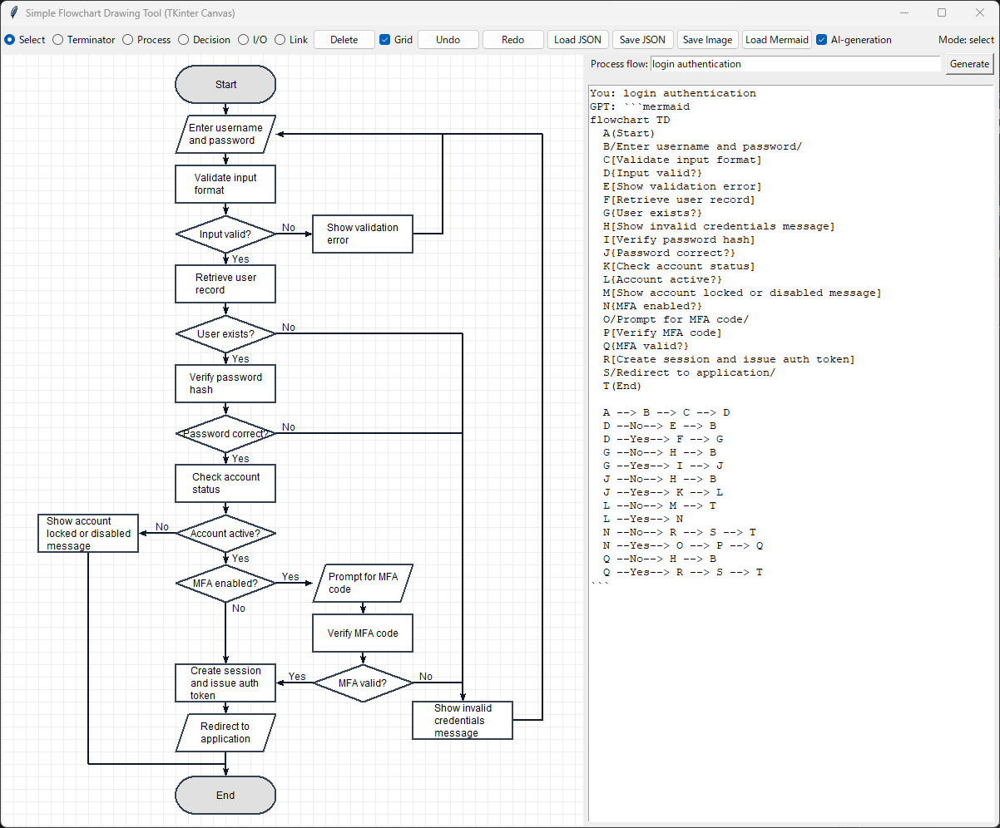

# flowchart-drawing-tool-python 簡易フローチャート描画ツール（Python版)

## 概要

このプロジェクトは、簡単にフローチャートを描画できるようにするために、「簡易フローチャート描画ツール(Python版)」を提供します。

## プロジェクトの目的

- フローチャートを書くときに以下のような悩みやストレスはありませんか？
  - 要件定義～詳細設計において、業務フローや処理ロジックを検討する際に、簡易的にフローチャートを使いたいけど、
安易に描画できて業務的にも使えそうなツールがなかなか見つからず、フローチャート作図のたびにイライラ
  - フローチャートをExcelやPowerPointで作図しているけど、満足した形に整えるのに時間がかかり、さらにフローチャートの変更による整えなおし作業にうんざり
  - 生成AIを活用する時代になって、文章だらけの仕様書になってしまった。生成AIにフローチャートを書かせてもイマイチで編集もできない

- そこで、「気軽に使えるフローチャート作図ツール」を目指して、Pythonで作成してみました。
- 簡易的なフローチャートを描くための基本的な機能が揃ってきたので、暫定版を公開します。
- なお、本ソースコードはChatGPTで作成した部分があり、コードが整理できていない箇所があります。徐々に整理していく予定です（汗

- 新機能：生成AI(GPT5.2)と連携して、フローチャートの自動作成に対応しました。（フローチャートの各要素や配線の手動調整作業は必要です）

## インストール

- 前提条件
  - Pythonコードが実行可能な環境で、さらに、TKinterライブラリのCanvasが利用可能な環境が必要です。
(Google ColaboratoryなどのWeb環境では動作不可、MacOSではTKInterが利用できる設定が必要です)

- インストール手順
  1. Python実行可能環境にて、当該プロジェクトのコードをチェックアウトします。
  2. チェックアウトフォルダにて、"pip install -r requirements.txt"を実行して、必要なパッケージをインストールします。
  3. 生成AIで処理フローを自動生成したい場合は、チェックアウトフォルダに".env"ファイルを作成し、OpenAI API Keyを以下の形式で
  記述します。（OpenAI API Keyの取得方法は、"Docs/OpenAI_API_Keyの取得方法(ChatGPT生成).md"を参照ください）
  
      「.envファイル内容(１行)」    OPENAI_API_KEY=(OpenAIから取得したAPI Key)
  
  4. 英語で使用したい場合は、constants_en.pyをconstants.pyに上書きコピーしてください。 
  5. flowchart_tool.pyを実行すると、フローチャート作図ツール画面が表示されます。

## 使い方

- 配置：メニュー欄で Process,Decision,Terminator,I/O を選択し、キャンバス内を選択することで要素を配置できます。
  -  [描画可能な要素]
     - Terminator：始端、終端、サブルーチン
     - Process：処理
     - Decision：分岐
     - I/O：入出力
- 接続：メニュー欄の Link を選択し、接続元要素と接続先要素を順に選択することで、要素間の接続線を描画できます。
- テキスト：キャンバス内の要素またはリンクをダブルクリックすることで、テキスト編集モードになります。
- 移動：メニュー欄の Select を選択し、キャンバス内の要素をドラッグアンドドロップすることで、要素を移動できます。
- 要素選択：メニュー欄の Select を選択し、要素をクリックすることで、当該要素を選択状態にできます。
- 複数選択：メニュー欄の Select を選択し、要素のない位置から矩形範囲を指定することで、矩形範囲内の複数要素が選択状態になります。
- 削除：メニュー欄の Delete ボタンを選択すると、選択状態の（複数）要素と、その要素のリンクが削除されます。
- UNDO/REDO：メニュー欄の UNDO, REDO ボタンを選択すると、直前の編集操作の取り消し,やり直しが可能です。
- インポート/エクスポート：キャンバス描画内容を画像(JPEG/PNG)またはJSON形式でファイルに出力したり、保存JSONファイルをインポートして再描画できます。
- Grid：メニュー欄のGridチェックボックスをONにすると、格子が表示され、要素の配置をグリッドで制限されるようになります。
- フローの自動生成：メニュー欄のAI-generationチェックボックスをONにして、表示される右サイドパネルにて自動生成したい処理フローを指定し、Generateボタンを押下することで、処理フローを自動生成できます。（フローの配置は手動で整えてください）
- リンク配線の手動調整：リンクを選択した状態で、CTRL+MouseWheelで接続点を巡回変更、SHIFT+MouseWheelで回り込みの距離を調整、CTRL+SHIFT+MouseWheelでリンクラベル位置を調整できます。

* exampleフォルダに、サンプルJSONファイルを配置しています。このファイルは[Load JSON]で読み込み可能です。

## 運用

- 現状の暫定版では、以下の利用を想定しています。
  1. フローチャート作図ツールを起動
  2. 手動作成の場合、
      1. 新規作成の場合は、フローチャートを作図
      2. 編集の場合は、保存データを読み込んでから編集
  3. 自動生成の場合、
      1. 自動作成したい処理フローを指定し、生成AIに自動作成を依頼
      2. 自動生成されたフローチャートの各要素や配線を手動調整
      3. フローチャートを確認し、必要に応じてフローを編集
  4. 完成したフローチャートのデータと画像を保存
  5. 資料に画像を張り付け

## 制限事項

- キャンバスのスクロールや拡大・縮小表示には未対応です（対応検討中）
- Windowsにおいて、複数ディスプレイで拡大率が異なる場合に「Save Image」の画像保存が正しく動作しません。その場合は、画面キャプチャツールなどを利用ください。

## 注意事項

- フローチャートの自動作成にはOpenAIのAPI(GPT5.2)を利用するため、自動生成を行うごとに GPT API の利用料が発生します。

## 対応予定内容

- メニュー構成の最適化
- キャンバスのスクロールや拡大・縮小表示
- 描画フローチャートのExcel出力対応
- 他要素の追加、スイムレーン描画
- など

## ライセンス

- このプロジェクトは、MIT Licence の下でライセンスされています。

## 更新履歴

* 2025/12/12 : 基本機能（暫定版）を公開
* 2025/12/15 : リンク配線ロジックの微調整、画像出力対応(JPEG/PNG)
* 2025/12/15b: REAMDEの更新、requirements.txtの追加
* 2025/12/16 : ノードをダブルクリックした際にノード位置がずれることへの対策
* 2025/12/16b: ポップアップメニューに対応、ツール終了時に確認ダイアログを表示
* 2025/12/16c: README内容を更新し、画像を追加
* 2025/12/17 : 複数要素の移動時に一部の要素が移動されない不具合を修正
* 2025/12/19 : 調整要素を定義ファイルに追加、日本語/英語別の設定例ファイルを追加、ソースコードを部分的に整理
* 2025/12/24 : リンク配線の手動調整に対応(CTRL+MouseWheel:接続点の変更、SHIFT+MouseWheel:回り込みの距離を調整)
* 2025/12/25 : 操作性の改善、ツール利用動画例を作成
* 2025/12/27 : Mermaid形式データの読み込みに対応、リンク配線の手動調整時のラベル位置の調整
* 2026/01/02 : 生成AI(GPT5.2)と連携して、フローチャートの自動作成に対応
* 2026/01/05 : AI作成フローの自動配置に対応（配置の手動調整は必要）
* 2026/01/08 : Windowsのディスプレイ拡大率100%以外での画像保存に対応、ショートカットキーの定義
* 2026/01/09 : MacOSでの表示調整
* 2026/01/13 : 不具合修正（生成AI連携、ファイルダイアログ指定）
* 2026/01/19 : リンクのラベル位置の手動調整に対応
* 2026/01/27 : リンク配線パターン(Bottom→Top, 5折れ線)への対応
* 2026/01/30 : リンク矢印定義（形状、向き）に対応、ラベルテキストの改行指定(\n)対応、不具合修正（リンクのラベル位置の手動調整）
* 2026/02/03 : マウスホイール操作の定義、Process図形で角丸矩形を選択可能に、リンク選択操作の改善
* 2026/02/09 : ノード塗りつぶし色の手動変更に対応
