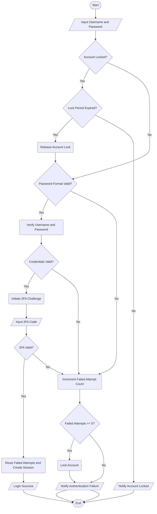

```mermaid
flowchart TD
  A@{ shape: stadium, label: "Start", bx: 0, by: 0 }
  B@{ shape: lean-r, label: "Input Username and Password", bx: 0, by: 1, details: "・Collect username or account ID\n・Collect password securely over TLS\n・Do not log raw credentials" }
  C@{ shape: diamond, label: "Account Locked?", bx: 0, by: 2, details: "・Check account lock status by username or account ID\n・Use a lock_until timestamp or equivalent\n・Avoid messages that reveal whether the account exists" }
  D@{ shape: diamond, label: "Lock Period Expired?", bx: -1, by: 3 }
  E@{ shape: rounded, label: "Release Account Lock", bx: -1, by: 4, details: "・Clear lock status when the configured lock period has expired\n・Reset or retain failed-attempt history according to security policy" }
  F@{ shape: diamond, label: "Password Format Valid?", bx: 0, by: 5, details: "・Password length must be 8 to 16 characters\n・Password must include letters, numbers, and special characters\n・Validate on the server side" }
  G@{ shape: rounded, label: "Verify Username and Password", bx: 0, by: 6, details: "・Compare password using a secure password hash\n・Use constant-time comparison where applicable\n・Return a generic authentication result" }
  H@{ shape: diamond, label: "Credentials Valid?", bx: 0, by: 7 }
  I@{ shape: rounded, label: "Initiate 2FA Challenge", bx: 1, by: 8, details: "・2FA is mandatory after valid password verification\n・Supported factors must be defined, such as TOTP, authenticator app, SMS, email, or hardware key\n・Set challenge expiration time and retry limits" }
  J@{ shape: lean-r, label: "Input 2FA Code", bx: 1, by: 9 }
  K@{ shape: diamond, label: "2FA Valid?", bx: 1, by: 10 }
  L@{ shape: rounded, label: "Increment Failed Attempt Count", bx: 0, by: 11, details: "・Count failed password-format, credential, and 2FA attempts as authentication failures\n・Store failed-attempt count per account\n・Consider rate limiting by IP/device as an additional control" }
  M@{ shape: diamond, label: "Failed Attempts >= 5?", bx: 0, by: 12 }
  N@{ shape: rounded, label: "Lock Account", bx: -1, by: 13, details: "・Lock account after five or more failed authentication attempts\n・Lock duration must be specified as a configurable security parameter\n・Record lock start time, lock_until time, and audit event" }
  O@{ shape: lean-r, label: "Notify Authentication Failure", bx: 0, by: 14, details: "・Display a generic failure message\n・If locked, notify that access is temporarily unavailable\n・Avoid exposing whether username, password, or 2FA failed" }
  P@{ shape: rounded, label: "Reset Failed Attempts and Create Session", bx: 1, by: 11, details: "・Reset failed-attempt count after successful password and 2FA verification\n・Create secure authenticated session\n・Set session timeout and secure cookie attributes" }
  Q@{ shape: lean-r, label: "Login Success", bx: 1, by: 12 }
  R@{ shape: stadium, label: "End", bx: 0, by: 15 }
  S@{ shape: lean-r, label: "Notify Account Locked", bx: -1, by: 5, details: "・Inform user that login is temporarily unavailable\n・Do not disclose sensitive account state beyond necessary lockout guidance" }

  A --> B --> C
  C -- "Yes" --> D
  C -- "No" --> F
  D -- "Yes" --> E --> F
  D -- "No" --> S --> R
  F -- "Yes" --> G --> H
  F -- "No" --> L
  H -- "Yes" --> I --> J --> K
  H -- "No" --> L
  K -- "Yes" --> P --> Q --> R
  K -- "No" --> L
  L --> M
  M -- "Yes" --> N --> O --> R
  M -- "No" --> O --> R
```
