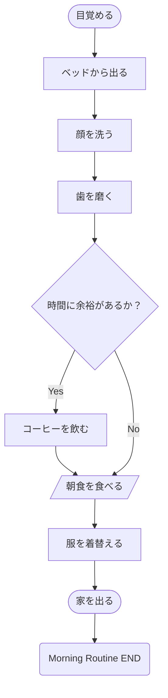

```mermaid
graph TD
    A([目覚める]) --> B[ベッドから出る] --> C[顔を洗う]
    C --> D[歯を磨く] --> E{時間に余裕があるか？}
    E -- Yes --> F[コーヒーを飲む] --> G[/朝食を食べる/]
    E -- No --> G
    G --> H[服を着替える]
    H --> I([家を出る])
    I --> J(Morning Routine END)
```